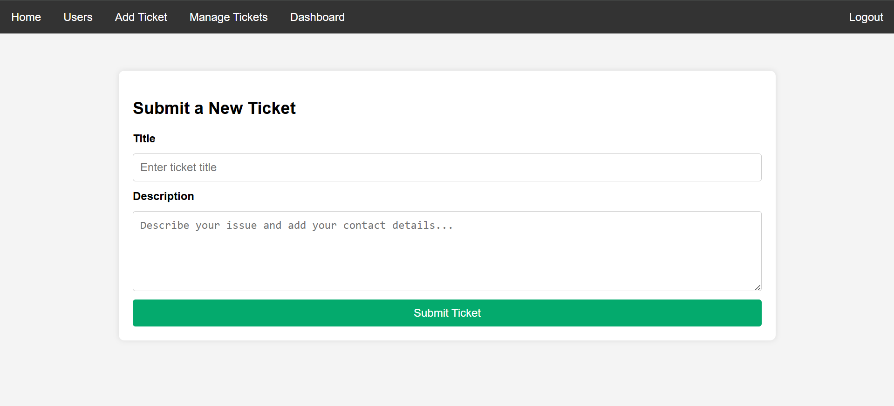
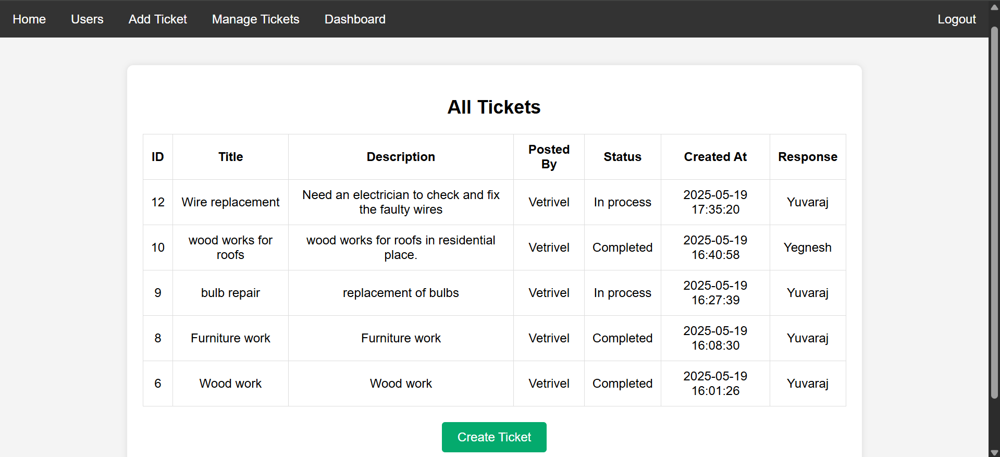
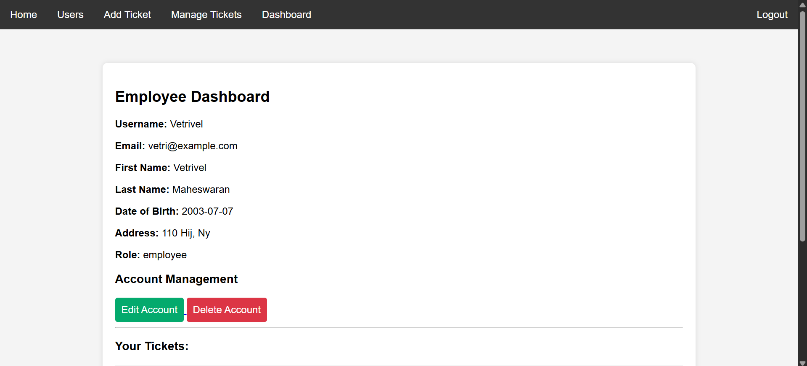
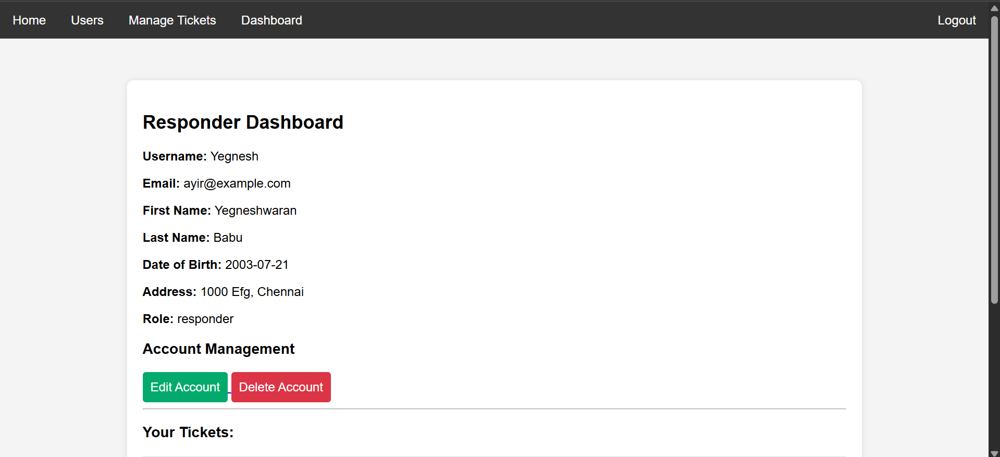

# Ticket Management System

Ticket Management System is a role-based web application designed to streamline the process of reporting, managing, and resolving service requests within an organization. Built using Flask and MySQL, the system supports two primary user roles — employees and responders — and enables structured ticket lifecycle management from creation to resolution.

Employees can register, log in, and submit detailed service tickets including title, description, and location of the issue. Responders are responsible for reviewing incoming tickets, updating their status (e.g., in process, completed, declined), and managing their workload via a dedicated dashboard.

## 📌 Features

- 🧾 **Employee Functions:**
  - Register and login securely
  - Submit new service tickets with title, description, and location
  - Manage submitted tickets: Edit, Delete
  - View ticket statuses: Pending, In Process, Completed
  - Dashboard view of their own tickets and account details

- 🛠️ **Responder Functions:**
  - Login to view all unassigned and in-progress tickets
  - Accept, decline, or complete tickets
  - Track own completed ticket history
  - Dashboard with role-specific ticket activity

- 🧑‍💼 **Admin View:**
  - View all registered users
  - View all ticket activities

## 🛠️ Tech Stack

- **Backend:** Flask, Flask-MySQLdb
- **Frontend:** HTML, CSS (custom), Jinja2 templates
- **Database:** MySQL
- **Libraries:** Werkzeug (password hashing), datetime

## 📁 Project Structure

```
/project-root/
│
├── app.py
├── requirements.txt
├── static/
│ ├── style.css
│ └── favicon.ico
│
├── templates/
│ ├── base.html
│ ├── login.html, register.html, create_ticket.html
│ ├── home.html, dashboard.html
│ ├── manage_tickets.html, update_ticket.html, edit_ticket.html
└── README.md
```
## 📸 Screenshots







## Author

👤 **[Vetrivel Maheswaran](https://github.com/Vetrivel07)**

## Connect With Me 🌐

**[](https://www.linkedin.com/in/vetrivel-maheswaran/)**

**[](https://vetrivel07.github.io/vetrivel-maheswaran)**

<p align="center"><b>© Created by Vetrivel Maheswaran</b></p?
