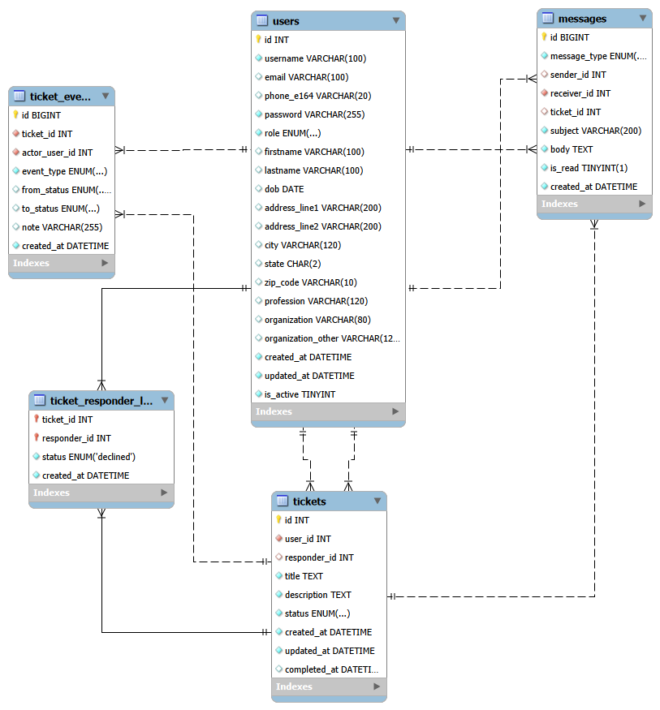

# Ticket Management System

The **Ticket Management System** is a streamlined communication platform designed to connect employees with professional responders to resolve technical or operational issues efficiently. The system acts as a digital service desk where employees can easily submit help requests, while responders can browse and claim tasks from an available pool. A key feature of the platform is its `one-at-a-time` assignment rule; once a responder accepts a ticket, it is locked to them to prevent confusion and ensure clear accountability for the resolution.

Beyond simple task tracking, the system includes built-in messaging for direct collaboration and a detailed history log that records every milestone of a ticket’s journey. This ensures that even if a responder changes or a user is deactivated, a complete paper trail of the work remains. By replacing messy email threads and manual logs with this organized digital workflow, the system ensures that no request is overlooked and every issue is handled by the right person at the right time. In this system, the Employee acts as the Requester who creates the ticket, while the Responder acts as the Service Provider who completes the task.

---

## Data Modeling & Architecture

The system utilizes a Relational Schema designed to handle complex lifecycles and role-specific access.

### 1. Users Table (The Identity Entity)

* **Purpose:** Centralizes all system participants (Employees and Responders) into a single entity to simplify authentication and role-based access.
* **Key Features:**
* **Role ENUM:** Strictly enforces whether a user is an 'employee' or 'responder'.
* **Soft Delete:** Uses `is_active (TINYINT)` to disable accounts without deleting historical data, ensuring `ON DELETE CASCADE` doesn't purge associated tickets.
* **Normalization:** Fields like `profession` and `organization` are stored directly for query performance (Denormalization).

### 2. Tickets Table (The Core Entity)

* **Purpose:** Acts as the central hub for the service contract between Employees and Responders.
* **Relationships:**
* **1:N (Employee):** Linked via `user_id` to the creator.
* **1:1 (Current Responder):** Linked via `responder_id`. This is `NULL` when pending and populated once a responder "claims" the ticket.

* **Business Logic:** Includes `completed_at` to measure performance and `status` ENUM to track the high-level lifecycle ('pending', 'in process', 'done').

### 3. Ticket Responder Log (State Management)

* **Purpose:** Tracks specific responder-ticket interactions, specifically for the "Decline" logic.
* **Modeling Choice:**
* **Composite Primary Key:** `(ticket_id, responder_id)` ensures a responder can only have one active state record per ticket.
* **Concurrency Control:** By storing a 'declined' state here, the backend can filter queries so the responder never sees that ticket again, even if it returns to the 'pending' pool.

### 4. Ticket Events (The Audit Entity)

* **Purpose:** A high-volume junction table that records the "Who, What, When, and How" of every ticket change.
* **Key Features:**
* **N:M Context:** Connects many users (Actors) to many tickets through various `event_types` (created, assigned, status_changed).
* **State Delta:** Captures `from_status` and `to_status` to allow for full reconstruction of a ticket's history for administrative review.

### 5. Messages Table (The Communication Entity)

* **Purpose:** Handles bidirectional communication between users and automated system alerts.
* **Modeling Choice:**
* **Self-Referencing FKs:** Both `sender_id` and `receiver_id` point back to the `users` table.
* **Optional Association:** `ticket_id` is a nullable Foreign Key. This allows messages to be "context-aware" (about a ticket) or general (user-to-user/system-wide).

## ## Entity-Relationship (ER) Summary

| Relationship | Type | Implementation |
| --- | --- | --- |
| **User to Ticket** | 1:N | `user_id` (FK) in Tickets. |
| **Responder to Ticket** | 1:N | `responder_id` (FK) in Tickets (Limited to 1 at a time). |
| **Ticket to Events** | 1:N | `ticket_id` (FK) in Events. |
| **Sender to Receiver** | N:M | Self-join on Users via Messages table. |
| **Ticket History** | M:N | Junction of Users and Tickets via `ticket_events`. |

---

## Data Model:

---

## 📌 Features

### 👥 Role Definitions
To ensure clarity across the system lifecycle:
* **The Employee:** The "Requester" who identifies an issue and **creates the request**.
* **The Responder:** The "Provider" who claims the ticket and **completes the task**.

### Employee Functionalities

* **Create Tickets:** Initialize a new support request by providing a `title` and `description` (inserts into `tickets` table).
* **Monitor Progress:** View the real-time `status` ('pending', 'in process', 'done') of their own tickets.
* **Communicate with Responders:** Send and receive direct messages (`messages` table) linked specifically to their active tickets.
* **Receive Notifications:** View `system alert` messages regarding ticket assignments or status updates.
* **Audit History:** View the `ticket_events` log to see when their ticket was edited or assigned.
* **Profile Management:** Update personal details like `profession`, `organization`, and `address` within the `users` table.

### Responder Functionalities

Responders are the "service providers" who manage the lifecycle of the tickets.

* **Browse Available Jobs:** View all tickets currently in `pending` status that have no `responder_id` assigned.
* **Claim/Accept Tickets:** Change a ticket status to `in process`. This "locks" the ticket by assigning their `responder_id` to the record, making it invisible to other responders.
* **Decline Tickets:** Release a ticket back to the public pool. This updates the `ticket_responder_log` to 'declined' and triggers a `ticket_event`. Due to your **Role-Based Condition**, the responder can no longer see that specific ticket.
* **Update Status:** Transition a ticket from `in process` to `done` once the work is finished.
* **Direct Messaging:** Message the employee directly to ask for more information or provide updates.
* **View Log History:** Review their own `ticket_responder_log` to see which tickets they have interacted with or declined in the past.

### System-Wide Logic

Beyond individual actions, the system enforces these automated constraints:

| Action | Logic Trigger | Result |
| --- | --- | --- |
| **Pick Up** | `UPDATE tickets SET responder_id = X` | Ticket disappears from the "Available" list for all other Responders. |
| **Decline** | `INSERT INTO ticket_responder_log` | `responder_id` in `tickets` returns to `NULL`; original Responder loses access. |
| **Soft Delete** | `UPDATE users SET is_active = 0` | User cannot log in, but all associated `tickets` and `messages` remain in the database for legal/audit purposes. |

---

## 🛠️ Tech Stack

| Component | Technology |
| --- | --- |
| **Backend** | `Python (Flask)` |
| **Database** | `MySQL` |
| **Frontend** | `HTML`, `CSS` |
| **Templating** | `Jinja2` |
| **Libraries** | `Werkzeug`, `datetime`, `phonenumbers` |
| **Server** | `Gunicorn` |

---

## 📸 Preview

---

## 🔔 Bells & Whistles

This project goes beyond basic ticketing by implementing several advanced features that ensure data integrity and a seamless user experience:

### 1. The "Contract-Lock" Mechanism

Unlike standard ticketing systems where multiple people might "grab" a task, this system implements a strict **exclusive assignment** rule. Using a custom backend condition class, once a responder claims a ticket, the database creates an atomic bond. This prevents "collision" between responders and ensures clear accountability, mimicking a real-world service contract.

### 2. High-Fidelity Audit Trail (Event Sourcing)

Every single change to a ticket—from a minor description edit to a status transition—is captured in the `ticket_events` table. This provides:

* **Historical Snapshots:** Ability to see exactly what a ticket looked like before and after a change.
* **Actor Tracking:** A permanent record of which user (Employee or Responder) performed specific actions, which is vital for conflict resolution.

### 3. Intelligent "Decline" Filtering

The system features a "one-way door" for responders who decline tickets. By utilizing a **Composite Primary Key** `(ticket_id, responder_id)` in the state log, the system prevents a responder from ever seeing or accidentally re-accepting a ticket they have already declined. This keeps the responder's dashboard clean and relevant.

### 4. Bulletproof "Soft Delete" Strategy

To maintain a 100% accurate historical record, the system avoids `DELETE` operations on users. Instead, it utilizes an `is_active` state management system. This ensures that even if a user leaves the organization, their past conversations, ticket contributions, and event logs remain intact for administrative review without breaking **Foreign Key** relationships.

### 5. Context-Aware Messaging

The communication engine is built with **Self-Referencing Foreign Keys**, allowing it to distinguish between general system alerts and ticket-specific discussions. This means messages are intelligently threaded, allowing users to view a conversation history directly within the context of the problem they are solving.

### 6. Robust Data Validation

Leveraging the `phonenumbers` (Google's libphonenumber port) and `Werkzeug` libraries, the system ensures that all contact data is stored in the globally recognized **E.164 format** and all credentials are encrypted using industry-standard hashing, making the system "production-ready" from day one.

---

## Author

👤 **[Vetrivel Maheswaran](https://github.com/Vetrivel07)**

## Connect With Me 🌐

****

****

<b>© Created by Vetrivel Maheswaran</b></p?
